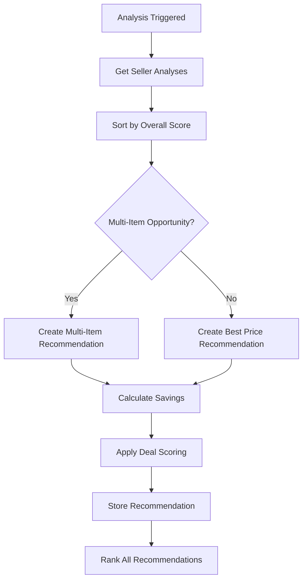

# VinylDigger Analysis Engine

*Last updated: July 2025*

## Overview

The VinylDigger Analysis Engine is a sophisticated system that processes search results to provide intelligent recommendations, cross-platform item matching, and seller optimization insights. This document provides comprehensive technical details for developers working with the analysis system.

## Core Architecture

### Service Layer

The Analysis Engine consists of three main services:

1. **ItemMatchingService** (`src/services/item_matcher.py`)
2. **SellerAnalysisService** (`src/services/seller_analyzer.py`)
3. **RecommendationEngine** (`src/services/recommendation_engine.py`)

### Data Models

The system uses five main database models for analysis:

1. **Seller** - Cross-platform seller information
2. **ItemMatch** - Canonical item representation for cross-platform matching
3. **SearchResultAnalysis** - Aggregate analysis data for searches
4. **SellerAnalysis** - Individual seller evaluation metrics
5. **DealRecommendation** - Generated recommendations with scoring

## Item Matching System

### Purpose
Identifies identical vinyl records across Discogs and eBay platforms to enable accurate price comparisons and deduplication.

### Algorithm Details

#### Text Normalization
```python
def normalize_text(text: str) -> str:
    """Normalize text for matching by removing special characters and standardizing format."""
    # Convert to lowercase
    # Remove special characters except spaces and alphanumeric
    # Normalize whitespace
    # Remove common stop words (the, a, an, etc.)
```

#### Similarity Calculation
Uses weighted Levenshtein distance with the following weights:
- **Title**: 50% weight
- **Artist**: 40% weight
- **Year**: 10% weight (when available)

#### Confidence Scoring
- **95-100%**: Exact or near-exact matches
- **85-94%**: High confidence matches (minor variations)
- **75-84%**: Medium confidence matches (require review)
- **65-74%**: Low confidence matches (manual verification needed)
- **<65%**: Not considered matches

#### Fingerprint Generation
Creates unique fingerprints for fast matching:
```python
fingerprint = normalize_text(f"{title}{artist}")
```

### Implementation

#### Finding Matches
```python
async def find_or_create_item_match(
    self,
    db: AsyncSession,
    item_data: dict,
    platform: SearchPlatform
) -> tuple[ItemMatch, float]:
    """Find existing match or create new canonical item."""
```

#### Match Storage
Matches are stored with:
- Canonical title/artist (normalized)
- Total match count
- Average confidence score
- Platform-specific variations

## Seller Analysis System

### Purpose
Evaluates sellers across multiple dimensions to identify optimization opportunities and provide comprehensive seller scoring.

### Scoring Components

#### 1. Reputation Score (0-100)
- **Feedback Score** (40 points): Platform-specific rating
- **Feedback Count** (30 points): Volume-based reliability
- **Positive Percentage** (30 points): Quality metric

```python
async def score_seller_reputation(self, seller: Seller) -> Decimal:
    """Calculate comprehensive reputation score."""
```

#### 2. Location Preference Score (0-100)
- **Exact Match**: 100 points (same country)
- **Regional Match**: 70 points (same region)
- **International**: 10-50 points (based on shipping complexity)

#### 3. Price Competitiveness (0-100)
- Compares seller's average prices against search averages
- **Top 10%**: 90-100 points
- **Top 25%**: 80-89 points
- **Average**: 50-70 points
- **Above Average**: 10-49 points

#### 4. Inventory Depth Score (0-100)
- **Multi-item sellers**: Higher scores
- **Want list concentration**: Bonus for relevant items
- **Collection overlap**: Penalty for duplicates

### Shipping Cost Estimation

#### Regional Pricing Matrix
```python
SHIPPING_ESTIMATES = {
    "US": {"US": 5.00, "CA": 15.00, "EU": 25.00, "UK": 25.00, "OTHER": 35.00},
    "CA": {"US": 15.00, "CA": 8.00, "EU": 20.00, "UK": 20.00, "OTHER": 30.00},
    "EU": {"US": 25.00, "CA": 20.00, "EU": 12.00, "UK": 15.00, "OTHER": 30.00},
    "UK": {"US": 25.00, "CA": 20.00, "EU": 15.00, "UK": 8.00, "OTHER": 30.00},
    "OTHER": {"US": 35.00, "CA": 30.00, "EU": 30.00, "UK": 30.00, "OTHER": 25.00}
}
```

#### Multi-Item Shipping
- **Base Cost**: Single item shipping
- **Additional Items**: 20% of base cost per additional item
- **Diminishing Returns**: Shipping scales sub-linearly

### Country Code Normalization

Advanced location parsing with state recognition:
```python
def normalize_country_code(location: str) -> str:
    """Smart location parsing with US state recognition."""
    # Recognizes US state abbreviations: CA, NY, TX, FL, etc.
    # Handles Canadian provinces
    # Maps EU countries to regional code
    # Fallback to "OTHER" for unknown locations
```

## Recommendation Engine

### Purpose
Generates actionable deal recommendations based on analysis data, with intelligent scoring and ranking.

### Recommendation Types

#### 1. Multi-Item Deal
- **Trigger**: Seller has 2+ items in search results
- **Value Proposition**: Shipping cost optimization
- **Scoring Factors**:
  - Number of want list items
  - Total potential savings
  - Seller reputation
  - Price competitiveness

#### 2. Best Price
- **Trigger**: Item significantly below average price
- **Value Proposition**: Exceptional pricing
- **Scoring Factors**:
  - Price differential from average
  - Item condition quality
  - Seller reliability

#### 3. High Value Discovery
- **Trigger**: Rare or valuable items identified
- **Value Proposition**: Collection enhancement
- **Scoring Factors**:
  - Rarity indicators
  - Market value analysis
  - Collection fit

### Scoring Algorithm

#### Overall Score Calculation
```python
def calculate_overall_score(self, seller_analysis: SellerAnalysis) -> Decimal:
    """Weighted scoring algorithm."""
    score = (
        seller_analysis.price_competitiveness * 0.3 +
        seller_analysis.seller_reputation_score * 0.25 +
        seller_analysis.inventory_depth_score * 0.25 +
        seller_analysis.location_preference_score * 0.2
    )
    return min(score, Decimal("100.0"))
```

#### Deal Score Mapping
- **90-100**: EXCELLENT
- **80-89**: VERY_GOOD
- **70-79**: GOOD
- **60-69**: FAIR
- **<60**: POOR

### Recommendation Generation Workflow



## API Integration

### Analysis Endpoints

#### Get Comprehensive Analysis
```http
GET /api/v1/analysis/search/{search_id}/analysis
```
Returns complete analysis including:
- Search statistics
- All recommendations
- Seller analyses with rankings
- Deal scores and potential savings

#### Get Multi-Item Deals
```http
GET /api/v1/analysis/search/{search_id}/multi-item-deals
```
Filtered view of recommendations focusing on shipping optimization.

#### Get Price Comparisons
```http
GET /api/v1/analysis/search/{search_id}/price-comparison
```
Cross-platform price analysis for matched items.

### Analysis Trigger

Analysis is automatically triggered when:
1. Search execution completes
2. New results are added to existing search
3. Manual analysis request (future enhancement)

## Performance Considerations

### Database Optimization

#### Indexes
- `seller.platform + platform_seller_id` (unique lookup)
- `search_result.search_id + item_match_id` (matching queries)
- `item_match.match_fingerprint` (similarity searches)
- `deal_recommendation.analysis_id + score_value` (ranking)

#### Query Patterns
- **Batch Operations**: Group database writes
- **Async Operations**: All I/O is asynchronous
- **Selective Loading**: Only load required relationships
- **Connection Pooling**: Reuse database connections

### Memory Management

#### Large Dataset Handling
- **Streaming Results**: Process search results in batches
- **Lazy Loading**: Load seller data on-demand
- **Result Limits**: Cap analysis to reasonable result counts
- **Garbage Collection**: Explicit cleanup of large objects

### Caching Strategy

#### Analysis Results
- **TTL**: Cache until search results change
- **Invalidation**: Clear on new search execution
- **Granular**: Cache individual analysis components
- **Compression**: Store large analysis data compressed

## Testing Strategy

### Unit Tests

#### Item Matching Tests
- Text normalization accuracy
- Similarity calculation correctness
- Confidence score validation
- Edge case handling (empty fields, special characters)

#### Seller Analysis Tests
- Scoring algorithm verification
- Shipping cost calculations
- Country code normalization
- Location preference logic

#### Recommendation Engine Tests
- Deal type classification
- Scoring accuracy
- Ranking correctness
- Edge cases (no sellers, single items)

### Integration Tests

#### End-to-End Workflow
- Complete analysis pipeline
- Database integration
- API endpoint functionality
- Error handling and recovery

### Test Data Patterns

#### Mock Search Results
```python
def create_mock_search_results(count: int = 10) -> list[SearchResult]:
    """Generate realistic test data with varying patterns."""
```

#### Mock Sellers
```python
def create_mock_sellers_with_feedback() -> list[Seller]:
    """Create sellers with realistic feedback patterns."""
```

## Error Handling

### Analysis Failures

#### Graceful Degradation
- **Partial Analysis**: Continue with available data
- **Fallback Scoring**: Use simplified algorithms
- **Error Logging**: Detailed logging for debugging
- **User Notification**: Clear error messages

#### Recovery Strategies
- **Retry Logic**: Exponential backoff for transient failures
- **Circuit Breaker**: Prevent cascade failures
- **Fallback Data**: Use cached analysis when available
- **Manual Intervention**: Admin tools for data correction

### Data Quality Issues

#### Input Validation
- **Required Fields**: Validate essential data presence
- **Data Format**: Ensure proper typing and format
- **Range Checks**: Validate numeric ranges
- **Consistency**: Cross-field validation

#### Cleanup Procedures
- **Orphaned Data**: Regular cleanup of unused records
- **Duplicate Detection**: Identify and merge duplicates
- **Data Migration**: Version upgrade procedures
- **Backup Strategy**: Point-in-time recovery

## Future Enhancements

### Machine Learning Integration

#### Price Prediction
- Historical price analysis
- Market trend identification
- Demand forecasting
- Seasonal adjustments

#### Seller Reliability Scoring
- Behavioral pattern analysis
- Risk assessment modeling
- Fraud detection
- Performance prediction

### Advanced Analytics

#### Collection Analytics
- Gap analysis for collections
- Completion recommendations
- Value tracking over time
- Market opportunity identification

#### Market Intelligence
- Price trend analysis
- Seller performance benchmarking
- Regional market differences
- Platform-specific insights

### Real-Time Features

#### Live Analysis
- Streaming analysis updates
- Real-time notifications
- Dynamic recommendation updates
- Live seller scoring

#### Collaborative Filtering
- User behavior analysis
- Community recommendations
- Crowd-sourced data quality
- Social features integration

## Configuration

### Environment Variables

```bash
# Analysis Engine Settings
ANALYSIS_ENABLED=true
ANALYSIS_MIN_RESULTS=5
ANALYSIS_MAX_RESULTS=1000
ANALYSIS_BATCH_SIZE=100

# Matching Settings
ITEM_MATCH_THRESHOLD=75.0
ITEM_MATCH_AUTO_APPROVE=85.0

# Scoring Settings
EXCELLENT_SCORE_THRESHOLD=90.0
VERY_GOOD_SCORE_THRESHOLD=80.0
GOOD_SCORE_THRESHOLD=70.0
FAIR_SCORE_THRESHOLD=60.0
```

### Feature Flags

```python
# Feature toggles for analysis components
FEATURES = {
    "item_matching": True,
    "seller_analysis": True,
    "recommendation_engine": True,
    "price_prediction": False,  # Future feature
    "ml_scoring": False,        # Future feature
}
```

## Monitoring and Observability

### Metrics

#### Performance Metrics
- Analysis completion time
- Matching accuracy rates
- Recommendation click-through rates
- Seller score distribution

#### Business Metrics
- Deal savings achieved
- User engagement with recommendations
- Cross-platform price differential
- Seller quality improvements

### Logging

#### Analysis Events
```python
logger.info("Analysis started", extra={
    "search_id": search_id,
    "result_count": len(results),
    "user_id": user_id
})
```

#### Error Tracking
```python
logger.error("Analysis failed", extra={
    "search_id": search_id,
    "error_type": type(e).__name__,
    "error_message": str(e),
    "traceback": traceback.format_exc()
})
```

### Alerting

#### Critical Issues
- Analysis pipeline failures
- Database connection issues
- External API failures
- Data quality problems

#### Performance Issues
- Slow analysis completion
- High memory usage
- Database query timeouts
- Cache hit rate degradation

---

*This documentation covers the complete VinylDigger Analysis Engine. For implementation details, refer to the source code in the `src/services/` directory.*
