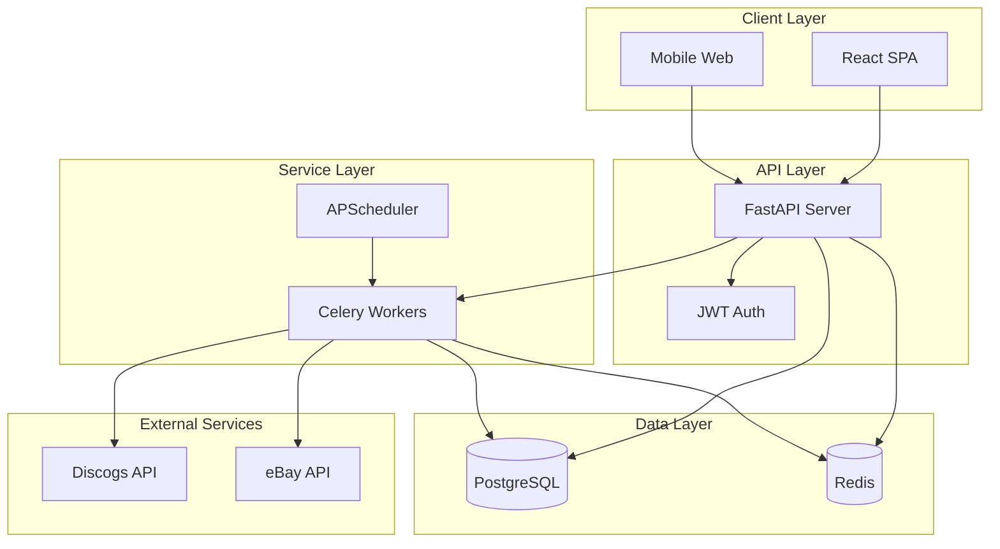

# VinylDigger Architecture Documentation

## System Overview

VinylDigger is a modern web application designed to help vinyl record collectors find the best deals across multiple marketplaces. The system employs a microservices architecture with clear separation between frontend, backend API, background workers, and scheduled tasks.



## Technology Stack

### Backend
- **Language**: Python 3.13
- **Framework**: FastAPI
- **ORM**: SQLAlchemy 2.0 (async)
- **Database**: PostgreSQL 16
- **Cache/Queue**: Redis 7
- **Task Queue**: Celery 5.3
- **Scheduler**: APScheduler 3.10
- **Authentication**: JWT (python-jose)
- **Security**: passlib, cryptography (Fernet)

### Frontend
- **Language**: TypeScript 5.7
- **Framework**: React 19
- **Build Tool**: Vite 6
- **Styling**: Tailwind CSS v4
- **UI Components**: Radix UI
- **State Management**: TanStack Query
- **Routing**: React Router v7
- **Forms**: react-hook-form + Zod

### Infrastructure
- **Containerization**: Docker & Docker Compose
- **Process Management**: Gunicorn (production)
- **Reverse Proxy**: Nginx (production)
- **CI/CD**: GitHub Actions
- **Monitoring**: Structured logging (future: OpenTelemetry)

## Core Components

### 1. API Server (FastAPI)

The API server handles all HTTP requests and provides RESTful endpoints.

**Key Features**:
- Async request handling for high performance
- Automatic OpenAPI documentation
- Request validation with Pydantic
- Dependency injection for clean code
- CORS middleware for cross-origin requests

**Directory Structure**:
```
backend/src/
├── api/v1/
│   ├── endpoints/     # API route handlers
│   ├── deps.py        # Common dependencies
│   └── router.py      # Main API router
├── core/
│   ├── config.py      # Configuration management
│   ├── database.py    # Database connection
│   └── security.py    # Security utilities
├── models/            # SQLAlchemy models
├── services/          # Business logic layer
└── workers/           # Background task definitions
```

### 2. Background Workers (Celery)

Celery workers handle long-running tasks asynchronously.

**Task Types**:
- **Search Execution**: Queries external APIs and processes results
- **Collection Sync**: Synchronizes user's Discogs collection
- **Want List Sync**: Synchronizes user's Discogs want list
- **Data Processing**: Matches results against collections

**Configuration**:
```python
# Celery configuration
broker_url = "redis://redis:6379/0"
result_backend = "redis://redis:6379/0"
task_serializer = "json"
result_serializer = "json"
accept_content = ["json"]
timezone = "UTC"
enable_utc = True
```

### 3. Task Scheduler (APScheduler)

APScheduler runs periodic tasks based on user preferences.

**Scheduled Tasks**:
- Check for due searches every hour
- Queue search execution tasks
- Clean up old search results (future)
- Generate reports (future)

### 4. Frontend Application (React)

Single-page application providing the user interface.

**Architecture Patterns**:
- Component-based architecture
- Custom hooks for business logic
- Context for authentication state
- React Query for server state management
- Lazy loading for code splitting

**Directory Structure**:
```
frontend/src/
├── components/        # Reusable UI components
├── pages/            # Route-based page components
├── hooks/            # Custom React hooks
├── lib/              # Utilities and helpers
├── services/         # API client services
└── types/            # TypeScript type definitions
```

## Data Architecture

### Database Schema

PostgreSQL database with the following main tables:

1. **users**: User accounts and authentication
2. **api_keys**: Encrypted external API credentials
3. **user_preferences**: User-specific settings
4. **saved_searches**: User's search configurations
5. **search_results**: Cached search results
6. **collections**: User's vinyl collections
7. **collection_items**: Individual items in collections
8. **want_lists**: User's want lists
9. **want_list_items**: Individual items in want lists

### Data Flow

1. **Search Flow**:
   ```
   User creates search → API stores in DB → Scheduler checks periodically
   → Worker executes search → Results stored in DB → User views results
   ```

2. **Collection Sync Flow**:
   ```
   User triggers sync → API queues task → Worker fetches from Discogs
   → Data processed and stored → Search results updated with matches
   ```

### Caching Strategy

Redis is used for:
- Celery task queue and results
- Session storage (future)
- API response caching (future)
- Rate limiting (future)

## Security Architecture

### Authentication & Authorization

1. **JWT Token Flow**:
   - User logs in with email/password
   - Server validates credentials
   - Server issues access token (30 min) and refresh token (7 days)
   - Client includes access token in Authorization header
   - Server validates token on each request

2. **Password Security**:
   - Passwords hashed using bcrypt
   - Configurable hash rounds
   - No password requirements (user's choice)

### API Key Encryption

External API keys are encrypted using Fernet symmetric encryption:

```python
# Encryption flow
plaintext_key → Fernet.encrypt() → stored in database
# Decryption flow
encrypted_key → Fernet.decrypt() → used in API calls
```

### Security Headers

Production deployment includes:
- HTTPS enforcement
- CORS configuration
- Security headers (CSP, HSTS, etc.)
- Rate limiting
- Request size limits

## Performance Considerations

### Backend Optimization

1. **Async Operations**: All I/O operations are async
2. **Connection Pooling**: Database and Redis connection pools
3. **Query Optimization**: Indexed foreign keys and search fields
4. **Pagination**: Large result sets are paginated
5. **Background Processing**: Heavy operations run in Celery

### Frontend Optimization

1. **Code Splitting**: Routes are lazy loaded
2. **React Query**: Intelligent caching and refetching
3. **Optimistic Updates**: UI updates before server confirmation
4. **Bundle Optimization**: Tree shaking and minification
5. **Image Optimization**: Lazy loading and responsive images

## Scalability Architecture

### Horizontal Scaling

1. **API Servers**: Multiple instances behind load balancer
2. **Workers**: Scale based on queue depth
3. **Database**: Read replicas for heavy queries
4. **Redis**: Clustering for high availability

### Vertical Scaling

1. **Database**: Optimized queries and indexes
2. **Workers**: Concurrent task execution
3. **Caching**: Multi-layer caching strategy

## Development Workflow

### Local Development

```bash
# Start all services
just up

# Backend development
just dev-backend    # Hot reload enabled

# Frontend development
just dev-frontend   # HMR enabled

# Run tests
just test
```

### Git Workflow

1. **Branching Strategy**: Feature branches from main
2. **Commit Convention**: Conventional commits
3. **Code Review**: PR required for main branch
4. **CI/CD**: Automated tests on every push

## Deployment Architecture

### Container Strategy

Each service runs in its own container:
- `backend`: FastAPI application
- `worker`: Celery worker processes
- `scheduler`: APScheduler instance
- `frontend`: Nginx serving static files
- `postgres`: PostgreSQL database
- `redis`: Redis cache/queue

### Environment Configuration

Environment-specific settings:
- Development: `.env` file
- Production: Environment variables
- Secrets: Encrypted in deployment platform

## Monitoring and Observability

### Logging

Structured JSON logging with:
- Request IDs for tracing
- User context
- Performance metrics
- Error details with stack traces

### Health Checks

- `/health`: API server health
- Docker health checks for all services
- Database connection monitoring
- External API availability checks

### Metrics (Future)

Planned metrics collection:
- Request latency
- Task execution time
- Queue depth
- Cache hit rates
- External API response times

## Error Handling

### API Error Responses

Consistent error format:
```json
{
  "detail": "Human-readable error message"
}
```

### Background Task Errors

- Automatic retry with exponential backoff
- Dead letter queue for failed tasks
- Error notifications (future)

## External Integrations

### Discogs API

- Rate limiting: 60 requests/minute
- Authentication: OAuth 1.0a
- Used for: Collection sync, want list sync, search

### eBay API

- Rate limiting: 5000 requests/day
- Authentication: OAuth 2.0
- Used for: Product search, seller information

## Future Architecture Enhancements

1. **GraphQL API**: For more flexible data fetching
2. **WebSocket Support**: Real-time notifications
3. **Microservices**: Separate search service
4. **Event Sourcing**: Audit trail for all changes
5. **API Gateway**: Centralized routing and auth
6. **Service Mesh**: Inter-service communication
7. **Multi-tenancy**: Organization support
8. **Mobile Apps**: Native iOS/Android apps
